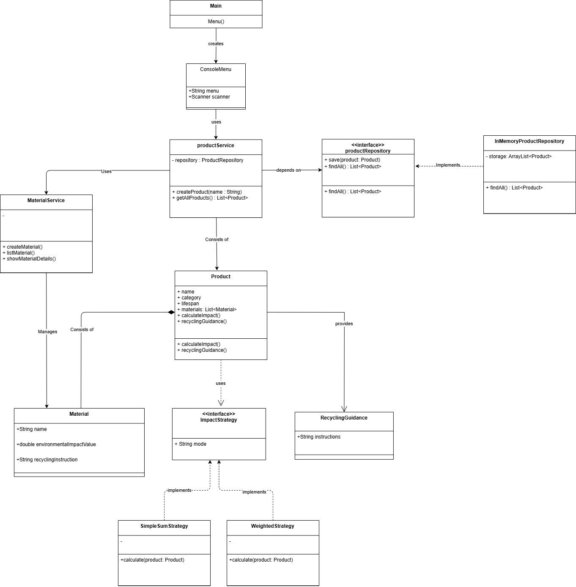

# Object-Oriented Design Project — Group 21

---

## Nouns (Classes)

| Class | Description | Collaborators |
|------|------------|--------------|
| **`Product`** | This class represents an item within the system, storing its name, category, and estimated lifespan | Materials (Consists of), Recycling Guidance (Provides), `EnvironmentalImpactStrategy` (Applies) |
| **`Material`** | This class defines a reusable substance with a specific name and a numerical environmental impact value. It also stores specific recycling instructions or categories. | - |
| **`Environmental Impact Strategy (Interface)`** | This interface defines the contract for calculating a product's environmental impact, enabling two algorithms to be used interchangeably. | - |
| **`SimpleSumStrategy / WeightedStrategy`** | This class implements the algorithm for calculating environmental impact. | `EnvironmentalImpactStrategy` (implements) |
| **`ProductRegistry / ProductService`** | This service manages the lifecycle and storage of all products and materials within the project. This class handles adding new items, retrieving the full list of products, and looking up information about a specific product. | product (consists of) |
| **`Menu`** | This class provides the structured, menu-driven interface that allows users to interact with the system via the console. | Product service (instantiates) |

---

## Verbs (Method Actions)

- Create  
- Define  
- List  
- View  
- Calculate  
- Implement  
- Replace  
- Provide  
- Handle  
- Seperate  
- Test  
- Build  
- Review  
- Refactor  
- Document  
- Demonstrate  

---

## Logic & Strategy Concepts

- **Impact Calculation Strategy**: The method used to figure out the environmental impact.  
- **Specific Strategies**: Different ways to calculate impact, such as using weight or the item's lifespan.  
- **Material Composition**: The list of materials that make up a specific product.  

---

## System Boundaries & Infrastructure

| In Scope | Out of Scope |
|----------|-------------|
| Product Management | No GUI |
| Impact calculations & Recycling guidance | No Database (SQL) |
| Testing and CI | No API integration (nothing not built by us) |
| Console UI | No coding until week 3-4 |

---

## Functional Requirements

- **Product Management**: Users can create products with a name, category, lifespan, and materials.  
- **Material Management**: The system stores materials with their impact values and recycling info.  
- **Product Listing & Detail**: Users can see a list of all products and view the details of any single item.  
- **Environmental Impact Calculation**: The system uses the Strategy Pattern to offer at least two different ways to calculate total impact.  
- **Recycling Guidance**: The system provides disposal tips based on what materials are in the product.  

---

## Non-Functional Requirements

- **Layered Architecture**: The code must be organized into three clear layers: Presentation (UI), Application (Tasks), and Domain (Core Logic).  
- **Logic Separation**: Keep user input and output separate from the actual business rules.  
- **Testability**: Use JUnit to test the core logic; these tests should not use the console or UI.  
- **Continuous Integration (CI)**: An automated system will build the project and run tests every time code is submitted.  
- **Design Standards**: Follow SOLID principles to ensure the code is easy to change and maintain.  
- **Interface Constraints**: The app must be a simple, menu-driven text program, not a graphical one.  

---

## Professional Git Workflow

To keep the project stable and the code clean during development, we must follow these rules:

- **Main Branch Protection**: You cannot save changes directly to the main branch.  
- **Branching Strategy**: Create a new branch for every new feature you work on.  
- **Merge Requirements**: Use Pull Requests to move code to the main branch after all tests have passed.  
- **Commit Quality**: Each save should have a clear message explaining exactly what was changed.  

---

## UML Diagram

---
## Design Rationale

### a) Identified Weakness

In our first design, the `Product` class directly depended on the `impactStrategy` class instead of an abstraction. This violated the Dependency Inversion Principle (DIP).

The main issue with this design is that `Product` was tightly coupled to a specific implementation of the impact calculation class. This means if the logic/strategy for calculating environmental impact changed, the `Product` class itself would need to change as well. This creates a weak system where changing one thing would require many changes along the chain.

Introducing any type of new strategy calculation would require changing both the `Product` class and the impact calculation class. Furthermore, due to tight coupling, the chosen strategy would likely be hardcoded instead of passed through dependency injection, which decreases reusability and violates the Open/Closed Principle, as the design is not open to extension without modification, and the Dependency Inversion Principle, as the design depends on concrete details instead of abstraction.

For example, if a new requirement states that users should be able to select different calculation methods at runtime, the old design would require adding conditional logic inside the `Product` class (if/else or switch statements), leading to code that is harder to maintain and scale.

### b) Principle Applied

The applied principles are the Dependency Inversion Principle (DIP) and Open/Closed principle (OCP).

In this project, `Product` is a core domain class and should not be dependent on lower-level specific calculation logic (impact calculation class). Instead, it should rely on a general interface (`impactStrategy`) that defines what needs to be done.

This principle matters because the system is expected to evolve over time and be scalable, meaning a change or extension of a class should not require changes to multiple other classes.

### c) Refactoring Move

- **Added**: `impactStrategy` interface  
- **Added**: `SimpleSumStrategy` and `WeightedStrategy` implementing the interface  
- **Modified**: `Product` to use `impactStrategy` instead of a concrete implementation  
- **Removed**: Direct dependency on a single impact calculation class  

This resolves the violation by decoupling `Product` from a specific impact calculation strategy. Now, any strategy that implements the interface can be used interchangeably.

### d) Design Impact

- **What is now easier to change?**  
  You can add new impact calculation strategies without modifying `Product`.  

- **What is now easier to test?**  
  You can inject test strategies into `Product`, making unit testing isolated from lower-level concrete implementations.  

- **What new capabilities does the design support without modification?**  
  The system now supports plugging in different strategies at runtime without modifying existing classes or adding excessive conditional logic.  
---